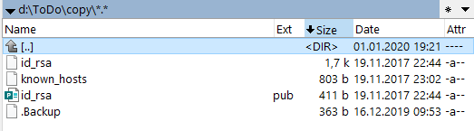

<!--Category:Powershell--> 
 <p align="right">
    <a href="https://www.powershellgallery.com/packages/ProductivityTools.ConvertTcx2Gpx/"></a>
    <a href="http://productivitytools.tech/convert-tcx-to-gpx/"><a> 
    <a href="https://github.com/pwujczyk/ProductivityTools.ConvertTcx2Gpx"></a>
</p>
<p align="center">
    <a href="http://productivitytools.tech/">
        
    </a>
</p>


# Backup files

Module allows to perform backup of the files. 
<!--more-->
General idea is to store small **.Backup** file which defines which catalog should be copied.
 


### Find-BackupFiles
Command finds .Backup files in given directory


```powershell
Find-BackupFiles -Source d:\ 
```

### New-Backup

```powershell
New-Backup -Source d: -Destination \\x\G\BackupPawelPC\ -Verbose -VerbosityLevel Detailed
```

Module first will download **GPSBabel** application which is used to perform conversion. application is stored directly in the GitHub.

<!--og-image-->


Next it will extract it and start the conversion.

